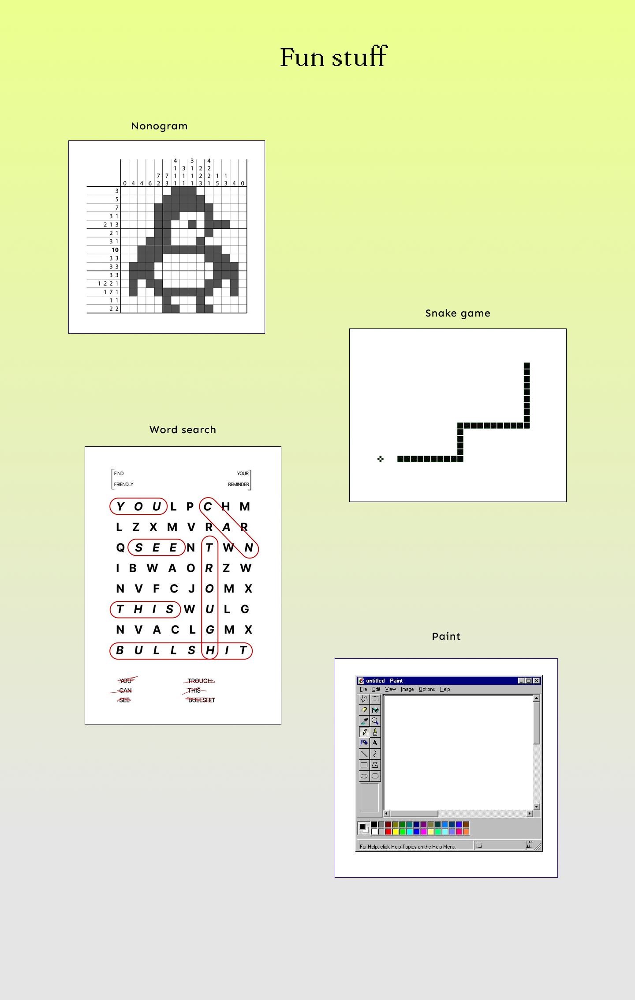
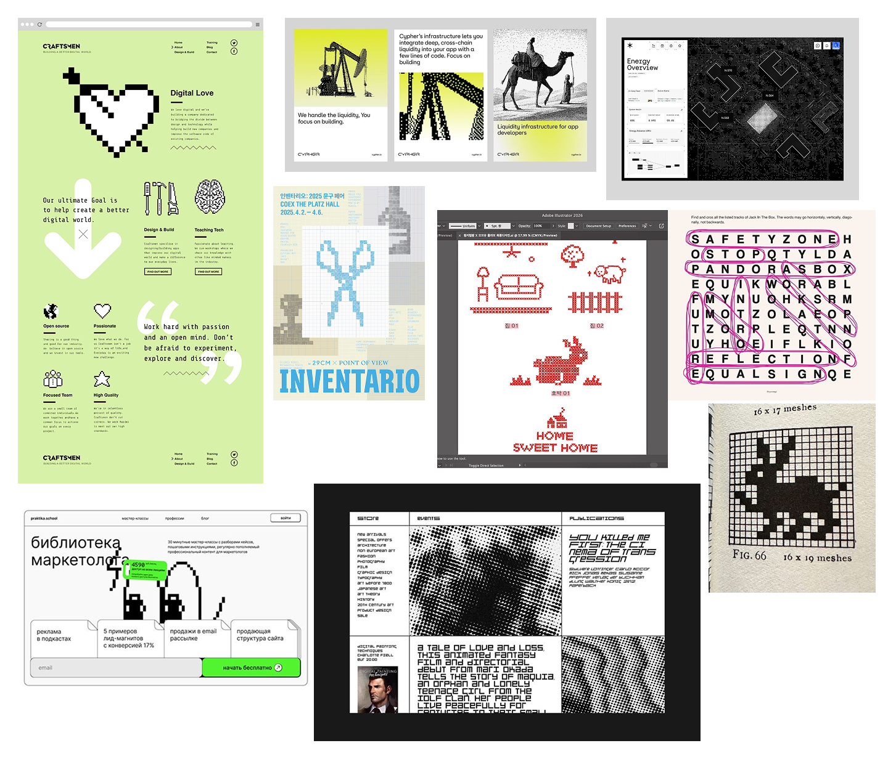

# PUNCH-UP PROPOSAL!

---

## 👾 Idea: Pixel Games 👾

I'm would like to build an interactive games page to add to my portfolio. It will feature 3-4 small, fully playable browser games built in React.  
**The possible games are:** 
* Nonogram logic puzzle
* Snake game
* Word search
* Pixel art canvas
* Connect the dots

The games are all pixel based and will have a consistent visual design that matches my portfolio aesthetic. They will be on one page either in a grid or a simple tab-based navigation between the games. The games will add an interactive element to my portfolio and allow me to showcase both coding and design skills.

---

## Lo-fi Mockups & Moodboard 

This is a lofi mockup of the layout and what the games may look like:

---

### Moodboard: 

---

## Resources

* Nonogram: Pure React state and CSS Grid
* Connect the Dots: SVG in React — MDN docs, with svg, circle, line elements
* Word Search: Pure React
* Pixel Canvas: HTML Canvas API

---

## Fears, Uncertainties & Doubts
### Time constraints: 
Although the projects doesn't seem that hard to code, I'm worried about how many I can finish within the time frame and whether this is too ambitious or not.
### Design style:
I would like the games to look cohesive and have a strong visual language so I am worried about how to make everything cohesive. I think I will be spending quite a bit of time creating a mockup and assets. 
